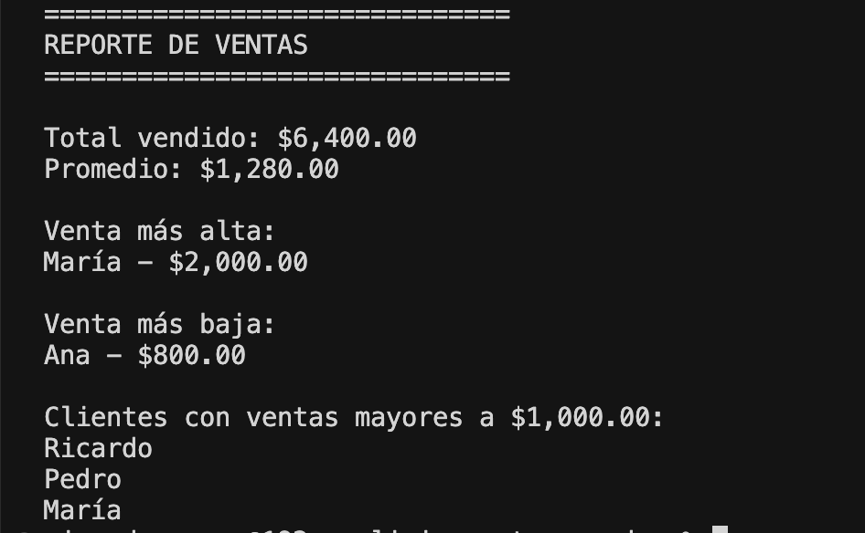
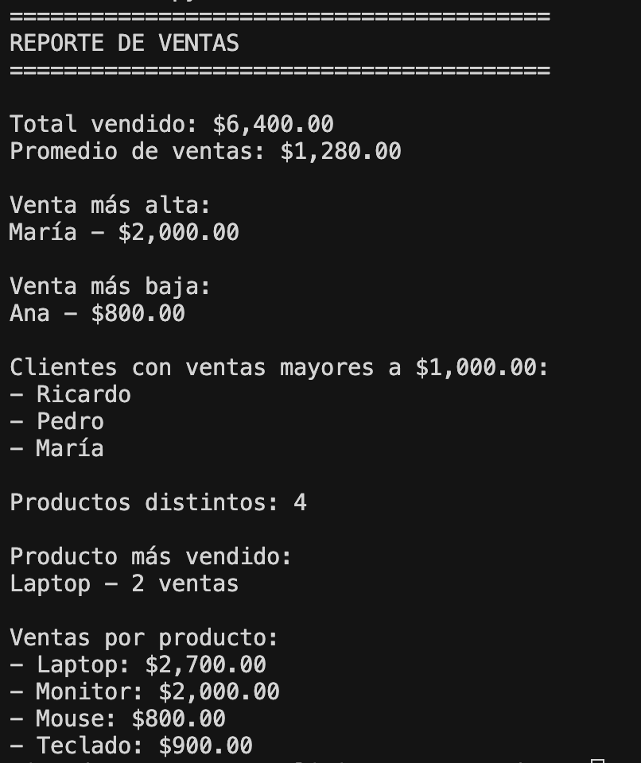
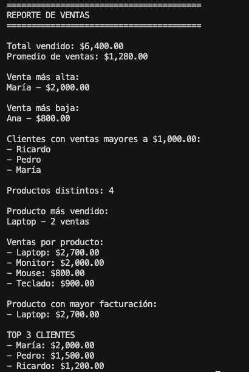

# Análisis de Ventas con Python y Pandas

## Descripción

Proyecto de análisis de datos desarrollado con **Python** y **Pandas**.

El programa procesa un conjunto de ventas y genera un reporte con métricas clave para obtener información sobre clientes, productos y rendimiento de ventas.

## Funcionalidades

- Total vendido
- Promedio de ventas
- Venta más alta
- Venta más baja
- Clientes con ventas superiores a $1,000
- Cantidad de productos distintos
- Producto más vendido
- Ventas totales por producto utilizando `groupby()`

## Tecnologías

- Python
- Pandas

## Ejecución

Instalar Pandas:

```bash
python3 -m pip install pandas
```

Ejecutar el programa:

```bash
python3 analisis.py
```

## Objetivo

Practicar conceptos fundamentales de análisis de datos utilizando Python y Pandas, incluyendo:

- Lectura de archivos CSV
- Manipulación de DataFrames
- Filtrado de información
- Estadísticas básicas
- Agrupación de datos con `groupby()`
- Conteo de registros con `value_counts()`
- Generación de reportes

## Ejemplo de salida

```text
========================================
REPORTE DE VENTAS
========================================

Total vendido: $6,400.00
Promedio de ventas: $1,280.00

Venta más alta:
María - $2,000.00

Venta más baja:
Ana - $800.00

Clientes con ventas mayores a $1,000.00:
- Ricardo
- Pedro
- María

Productos distintos: 4

Producto más vendido:
Laptop - 2 ventas

Ventas por producto:
- Laptop: $2,700.00
- Monitor: $2,000.00
- Mouse: $800.00
- Teclado: $900.00

Producto con mayor facturación:
- Laptop: $2,700.00

TOP 3 CLIENTES
- María: $2,000.00
- Pedro: $1,500.00
- Ricardo: $1,200.00
```

## Evolución del Proyecto

### Versión inicial



### Versión mejorada



## Versión actual



## Autor

**Ricardo Romero**

Proyecto realizado como parte de mi aprendizaje de Python y análisis de datos con Pandas.